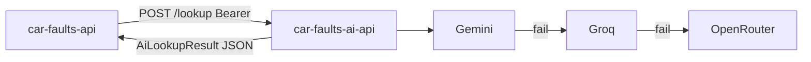

# Car Faults AI API

AI microservice for **Car Faults** — generates structured **chronic reliability** lookups by vehicle make / model / year / engine, and translates known-issue content between product locales.

Consumed by [`car-faults-api`](../car-faults-api) (Nest backend) when Redis and Postgres miss. Product languages: `pt-PT`, `en-GB` and `es-ES`. Initial market: **Portugal**.

## What we are

Structured AI answers for Nest: *for this model, what typically fails, how severe it is, typical cost, and how it gets fixed?*

We return camelCase JSON that matches Nest’s
[`AiLookupResult`](../car-faults-api/src/ai/ai-lookup.provider.ts)
(`knownIssues`, `estimatedCostEur`, `techSpecs`, …). Providers run as a free-tier chain: **Gemini → Groq → OpenRouter `:free`**. Local/CI can use a deterministic **stub** with no network calls.

## What we are not

- Not the public user-facing API (that is Nest + the Next.js frontend).
- Not a database or cache — this service is **stateless** by design.
- Not VIN history, odometer fraud checks, or accident records (same boundary as the product).
- Not a substitute for a mechanic — results are **indicative**, AI-generated, and should be treated as such in product copy.

## Problem we solve

Nest needs structured known-issue JSON without embedding provider SDKs, prompts, or failover logic. This service isolates the AI provider chain, versioned prompts, and a stable HTTP contract so Nest can focus on auth, persistence, and Redis caching.

## Stack

| Layer | Technology |
|-------|------------|
| API | FastAPI + Pydantic |
| HTTP client | httpx (provider calls) |
| AI | Gemini → Groq → OpenRouter `:free` (or stub) |
| Prompts | Versioned text files under `app/prompts/v1/` |
| Auth | Shared `API_KEY` as `Authorization: Bearer …` |
| Runtime | Distroless Docker image (optional) |

## What this service does

1. `POST /lookup` — known issues + fixes (+ tech specs) for a vehicle
2. `POST /translate` — translate existing `knownIssues` between `pt-PT`, `en-GB` and `es-ES`
3. `GET /health` — liveness only (no auth, no external calls)
4. Provider chain with sequential failover; stub mode for local/CI
5. Versioned prompts (bump folder to `v2` without changing provider code)

## How it fits

Nest lookup path: Redis → Postgres → **this service** on miss. Then Nest persists and warms Redis.



Wire Nest’s `.env`:

```bash
AI_PROVIDER=http
AI_API_URL=http://localhost:8000/lookup
AI_API_KEY=<same value as API_KEY here>
```

See [`http-ai-lookup.provider.ts`](../car-faults-api/src/ai/http-ai-lookup.provider.ts) for the calling side.

AI content is marked as generated on the product side; treat results as indicative.

## Contract

Auth on `/lookup` and `/translate`: `Authorization: Bearer {API_KEY}`.

| Status | When |
|--------|------|
| **401** | Missing or wrong Bearer token |
| **422** | Invalid body |
| **503** | Every provider in the chain failed |

Swagger: http://localhost:8000/docs — ReDoc at `/redoc`.

### Lookup — `POST /lookup`

**Request:**

```json
{
  "brand": "Volkswagen",
  "model": "Polo",
  "year": 2015,
  "engine": "1.2 TSI",
  "fuelType": "gasoline",
  "doors": 5,
  "language": "en-GB"
}
```

`language` defaults to `en-GB` (`pt-PT` | `en-GB` | `es-ES`).
`fuelType`: `gasoline` | `diesel` | `electric` | `gpl` | `hybrid`. When
`electric`, `engine` may be the sentinel `"electric"` instead of a real
engine code.

**Response** (`200`, mirrors `AiLookupResult`):

```json
{
  "vehicle": {
    "brand": "Volkswagen",
    "model": "Polo",
    "name": "Polo 6C",
    "year": 2015,
    "engine": "1.2 TSI",
    "fuelType": "gasoline",
    "doors": 5,
    "techSpecs": { "power_hp": 90 }
  },
  "knownIssues": [
    {
      "title": "Timing chain tensioner wear (EA211 1.2 TSI)",
      "description": "...",
      "severity": "high",
      "typicalKm": 80000,
      "sources": ["VW owner forums"],
      "fixes": [
        {
          "summary": "Replace timing chain, tensioner and guides",
          "steps": "...",
          "estimatedCostEur": 650
        }
      ]
    }
  ]
}
```

`severity`: `low` | `medium` | `high` | `critical`.

### Translate — `POST /translate`

**Request:**

```json
{
  "sourceLanguage": "en-GB",
  "targetLanguage": "pt-PT",
  "knownIssues": [
    {
      "title": "Timing chain tensioner wear (EA211 1.2 TSI)",
      "description": "...",
      "severity": "high",
      "typicalKm": 80000,
      "sources": ["VW owner forums"],
      "fixes": [
        {
          "summary": "Replace timing chain, tensioner and guides",
          "steps": "...",
          "estimatedCostEur": 650
        }
      ]
    }
  ]
}
```

**Response** (`200`): `{ "knownIssues": [ … ] }` with the same shape, translated to `targetLanguage`.

## Getting started

```bash
python -m venv venv
source venv/bin/activate
pip install -r requirements.txt -r requirements-dev.txt

cp .env.example .env   # then edit as needed

uvicorn app.main:app --reload --port 8000
```

### Useful URLs

| Resource | URL |
|----------|-----|
| Health | `GET http://localhost:8000/health` |
| Swagger UI | `http://localhost:8000/docs` |
| ReDoc | `http://localhost:8000/redoc` |

## Environment variables

Copy [`.env.example`](.env.example) to `.env`:

| Variable | Purpose |
|---|---|
| `APP_ENV` | `development` / `production` / `test` |
| `API_KEY` | Shared secret Nest sends as Bearer token |
| `CORS_ALLOWED_ORIGINS` | JSON array of origins (empty → `*`) |
| `AI_PROVIDER_MODE` | `stub` (no network) or `chain` (real providers) |
| `GEMINI_API_KEY` / `GROQ_API_KEY` / `OPENROUTER_API_KEY` | Omit a key to skip that provider |
| `GEMINI_MODEL` / `GROQ_MODEL` / `OPENROUTER_MODEL` | Model ids per provider |
| `AI_TIMEOUT_SECONDS` | Per-provider request timeout |
| `LOG_LEVEL` | Python logging level |

`AI_PROVIDER_MODE=chain` with no provider keys falls back to the stub automatically.

## Tests

```bash
# lint
ruff check app tests
ruff format --check app tests

# tests
make test

# tests + coverage (prints TOTAL summary + per-file missing lines)
make test-coverage
```

Tests load `.env.test` (`AI_PROVIDER_MODE=stub`) so the suite never calls a real provider. Coverage gate: **90%+**. PRs and pushes to `main` run lint (Ruff) and `pytest` with this gate in CI (see [`.github/workflows/ci.yml`](.github/workflows/ci.yml)).

## Docker

```bash
docker build -t car-faults-ai-api .
docker run --rm -p 8000:8000 --env-file .env car-faults-ai-api
```

Multi-stage build onto a distroless nonroot image — no shell, no pip in the runtime layer.

## License

Proprietary — All Rights Reserved (Daniel Fonseca da Silva). See [license](license).
Use and run allowed; modification and derivative works require written permission.
